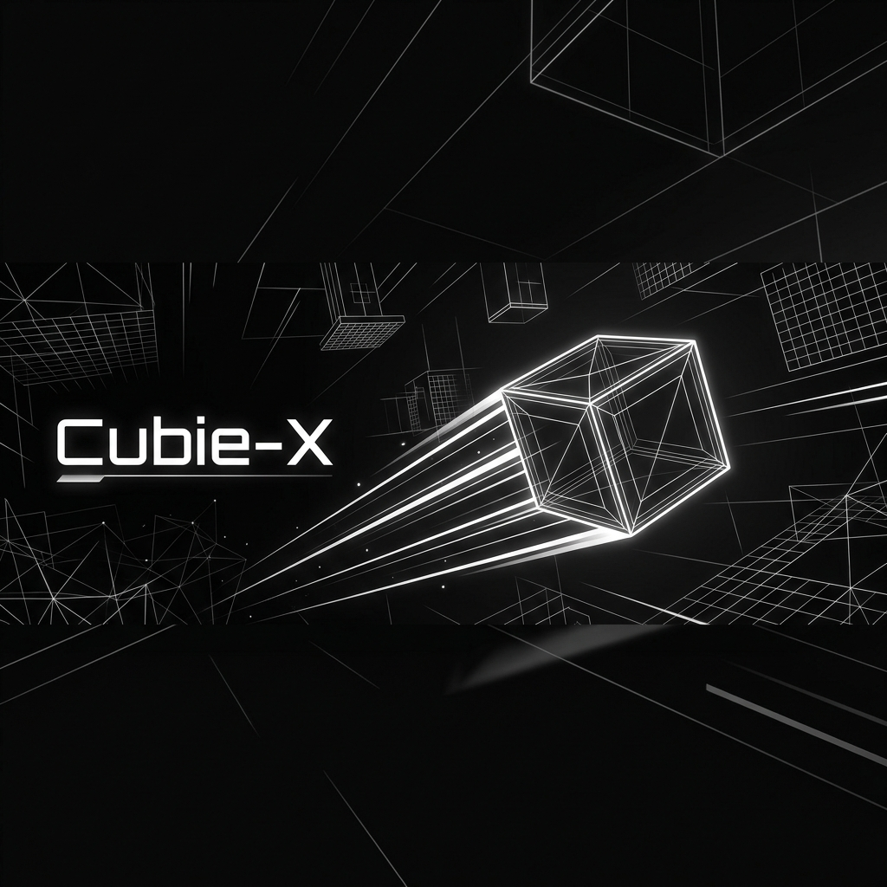

<div align="center">
  
  <h1>🧊 Cubie-X</h1>
  <h3>The Ultimate High-Performance Vector Runner</h3>
  <p><i>Precision Physics • Global Competition • Hardened Security</i></p>

  <br />

  [](https://firebase.google.com/)
  [](https://vitejs.dev/)
  [](https://reactjs.org/)
  [](https://www.typescriptlang.org/)
  
  <br />

  ### [🎮 Play Cubie-X Now](https://cubiex.web.app)
</div>

---

## 🚀 Overview

**Cubie-X** is an ultra-smooth, physics-based vector runner built for the modern web. Navigate through high-velocity zones, avoid obstacles, and dominate the global leaderboards in a game designed for zero-latency feedback and complete system integrity.

## ✨ Core Features

- **Identity Protocol**: A specialized onboarding flow to establish unique runner identities.
- **Unique Namespace**: Real-time Firestore validation ensures every identity is unique across the global grid.
- **Deterministic Physics**: Frame-rate independent gameplay for consistent competition across all devices.
- **Global Hall of Fame**: Real-time leaderboards powered by optimized Firestore queries.
- **Dynamic Zones**: Procedural difficulty scaling that adapts to your performance.
- **Procedural Audio**: Real-time synthesized sound effects using the Web Audio API for a zero-latency minimalist soundscape.

## 🛡️ Hardened Security & Performance

Cubie-X is engineered for production-grade stability:
- **Server-Side Rate Limiting**: Implemented robust `firestore.rules` to prevent API spamming and protect quotas.
- **Write Throttling**: 30-second cooldowns on identity claims and checkpoint saves to ensure long-term scalability.
- **Data Integrity**: Enforced `serverTimestamp()` validation for all leaderboard entries to prevent client-side clock tampering.
- **Optimized Indexing**: Custom composite indexes for high-speed, filtered leaderboard retrieval.

## 🛠 Tech Stack

- **Frontend**: React 19 + Vite 6 + TypeScript
- **Engine**: Custom Canvas-based 2D Vector Engine
- **Animation**: Motion (formerly Framer Motion) for premium UI transitions
- **Backend**: Firebase (Auth, Firestore, Hosting)
- **Audio**: Custom Procedural Web Audio Engine
- **Deployment**: Automated Cloud Deployment with Firebase CLI

## 🏃 Local Development

### Prerequisites
- Node.js (v18+)
- Firebase CLI (optional, for deployment)

### Setup
1. **Clone & Install**:
   ```bash
   git clone [repository-url]
   npm install
   ```

2. **Run Locally**:
   ```bash
   npm run dev
   ```

## 🔧 Recent Improvements

- **Security Hardening**: Integrated server-side throttling for score submissions and identity updates.
- **Branding Revamp**: Full identity overhaul with "Cubie-X" branding across the UI and metadata.
- **Leaderboard Logic**: Implemented `reason == 'gameOver'` filtering for cleaner public Hall of Fame rankings.
- **Performance**: Migrated to event-driven UI updates to reduce browser main-thread overhead.

---

<div align="center">
  <sub>Built with ❤️ by <b>Olix Studios</b></sub>
</div>
